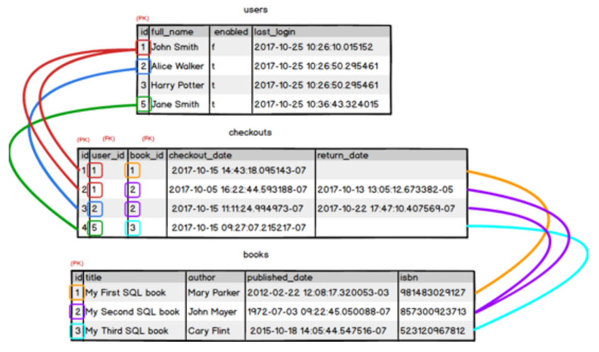

# Structured Query Language (SQL)

## What is SQL
SQL stands for Structured Query Language. It let's you access and manipulate databases.

## What is a Database
A database is a collection of (connected) tables that stores a specific set of structured data.

## What is a Table
A Table is essentially a spreadsheet with data organized in rows and columns. Each row is a record, and each column is a field. Each table has a unique name.

## Resume
The language to manage, access, edit, and communicate with a collection of connection tables is SQL.


## SQL Commands
- SELECT: Extract data from a database;
- DELETE: Delete data from a database;
- INSERT INTO: Insert new data into a database;
- CREATE DATABASE: Create a new database;
- CREATE TABLE: Create a new table;
- DROP TABLE: Delete a table

# sqlite3
## Example code
```python
import sqlite3

# connect to a Sqlite Database (or create a new one)
conn = sqlite3.connect("SW12/testDB.db")

# get a cursor object to interact with the Database
cursor = conn.cursor()

# write query
sql_querry = """
SELECT id,name
FROM test_table
WHERE id != 1
"""
# execute querry
cursor.execute(sql_querry)
# to read out the answer, if any -> iterate through the cursor
for row in cursor:
    print(row) # print Answer, row by row

conn.close()
```
### Changes
sqlite3, unlike SQLite, doesn't automatically save changes to the database. To make your changes permanent:
```python
import sqlite3
conn.commit()

conn.close()
```

## Adding data
```python
import sqlite3

conn = sqlite3.connect("SW12/testDB.db")
cursor = conn.cursor()

# write query (SQL SYNTAX)
sql_querry = """
INSERT INTO test_table (id, name)
VALUES (1, 'Joe Mama')
"""
# execute querry
cursor.execute(sql_querry)

# to save changes
conn.commit()
conn.close()
```

## Temp files (Journal)
SQLite uses a temporary file to store changes before they are committed to the database. This is called a journal file. It allows SQLite to roll back changes if something goes wrong during the transaction. The journal file is deleted when the transaction is completed successfully.

### Example
```python
# ... code before

sql_querry = """
INSERT INTO test_table (id, name)
VALUES (9, 'Pippo Franco')
"""

cursor.execute(sql_querry)
if input("Do you want to commit? (y/n)") == "y":
    # while the input is pending, a journal file is created.
    conn.commit()

# code after ...
```